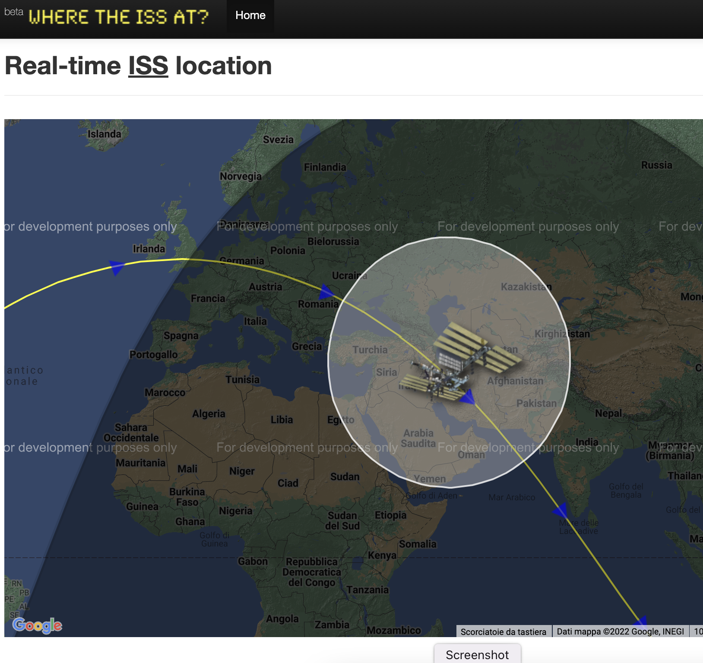

This project will show you how to work with JSON data from an API including how to load JSON data with fetch() and update DOM element.

The Coding Train - Daniel Shifmann - <a href="https://www.youtube.com/watch?v=uxf0--uiX0I&list=PLRqwX-V7Uu6YxDKpFzf_2D84p0cyk4T7X&index=6&t=244s">course<a>

Comunicate with the API of the site Where the ISS at?: https://wheretheiss.at/ - International Space Station real time location.

